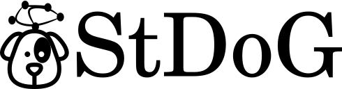
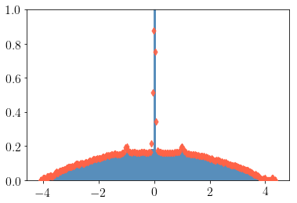

#  
# Structure and Dynamics on Graphs (Beta)

The main goal of StDoG is to provide a package which can be used to study
dynamical and structural properties (like spectra) on/off graphs with a large
number of vertices. The modules of StDoG are being built by
combining codes written in *Tensorflow* + *CUDA* and *C++*.

## 1 - Install

```
pip install stdog
```

## 2 - Examples

### 2.1 - Dynamics

#### 2.1.1 - Kuramoto

##### Tensorflow
```python
import numpy as np
import igraph as ig
from stdog.utils.misc import ig2sparse  #Function to convert igraph format to sparse matrix


num_couplings = 40
N = 20480

G = ig.Graph.Erdos_Renyi(N, 3/N)
adj = ig2sparse(G)

omegas = np.random.normal(size= N).astype("float32")
couplings = np.linspace(0.0,4.,num_couplings)
phases =  np.array([
    np.random.uniform(-np.pi,np.pi,N)
    for i_l in range(num_couplings)

],dtype=np.float32)


precision =32

dt = 0.01
num_temps = 50000
total_time = dt*num_temps
total_time_transient = total_time
transient = False
```

```python
from stdog.dynamics.kuramoto import Heuns

heuns_0 = Heuns(adj, phases, omegas, couplings, total_time, dt,         
    device="/gpu:0", # or /cpu:
    precision=precision, transient=transient)

heuns_0.run()
heuns_0.transient = True
heuns_0.total_time = total_time_transient
heuns_0.run()
order_parameter_list = heuns_0.order_parameter_list # (num_couplings, total_time//dt)
```
```python
import matplotlib.pyplot as plt

r = np.mean(order_parameter_list, axis=1)
stdr = np.std(order_parameter_list, axis=1)

plt.ion()
fig, ax1 = plt.subplots()
ax1.plot(couplings,r,'.-')
ax2 = ax1.twinx()
ax2.plot(couplings,stdr,'r.-')
plt.show()
```


#### CUDA - Faster than Tensorflow implementation

If CUDA is available. You can install our another package,
[stdogpkg/cukuramoto](https://github.com/stdogpkg/cukuramoto) (C)
```
pip install cukuramoto
```

```python
from stdog.dynamics.kuramoto.cuheuns import CUHeuns as cuHeuns

heuns_0 = cuHeuns(adj, phases, omegas,  couplings,
    total_time, dt, block_size = 1024, transient = False)

heuns_0.run()

heuns_0.transient = True
heuns_0.total_time = total_time_transient
heuns_0.run()
order_parameter_list = heuns_0.order_parameter_list #
```
### 2.2 Spectral 

#### Spectral Density

The Kernel Polynomial Method can estimate the spectral density of large sparse Hermitan matrices with a computational cost almost linear. This method combines three key ingredients: the Chebyshev expansion + the stochastic trace estimator + kernel smoothing.

```python
import igraph as ig
import numpy as np

N = 3000
G = ig.Graph.Erdos_Renyi(N, 3/N)

W = np.array(G.get_adjacency().data, dtype=np.float64)
vals = np.linalg.eigvalsh(W).real
```

```python
import stdog.spectra as spectra
from stdog.utils.misc import ig2sparse 

W = ig2sparse(G)
num_moments = 300
num_vecs = 200
extra_points = 10
ek, rho = spectra.dos.kpm(W, num_moments, num_vecs, extra_points, device="/gpu:0")
```

```python
import matplotlib.pyplot as plt
plt.hist(vals, density=True, bins=100, alpha=.9, color="steelblue")
plt.scatter(ek, rho, c="tomato", zorder=999, alpha=0.9, marker="d")
plt.ylim(0, 1)
plt.show()
```

#### Trace Functions through Stochastic Lanczos Quadrature (SLQ)[1]


##### Computing custom trace functions

```python
from stdog.spectra.trace_function import slq
import tensorflow as tf

def trace_function(eig_vals):
    return tf.exp(eig_vals)

num_vecs = 100
num_steps = 50
approximated_estrada_index, _ = slq(L_sparse, num_vecs, num_steps,  trace_function, device="/gpu:0")
exact_estrada_index =  np.sum(np.exp(vals_laplacian))
approximated_estrada_index, exact_estrada_index
```
The above code returns

```
(3058.012, 3063.16457163222)
```
##### Entropy
```python
import scipy
import scipy.sparse
from stdog.spectra.trace_function import entropy as slq_entropy

def entropy(eig_vals):
  s = 0.
  for val in eig_vals:
    if val > 0:
      s += -val*np.log(val)
  return s

L = np.array(G.laplacian(normalized=True), dtype=np.float64)
vals_laplacian = np.linalg.eigvalsh(L).real

exact_entropy =  entropy(vals_laplacian)

L_sparse = scipy.sparse.coo_matrix(L)
    
num_vecs = 100
num_steps = 50
approximated_entropy = slq_entropy(
    L_sparse, num_vecs, num_steps, device="/cpu:0")

approximated_entropy, exact_entropy
```
```
(-509.46283, -512.5283224633046)
```


[[1] Ubaru, S., Chen, J., & Saad, Y. (2017). Fast Estimation of tr(f(A)) via Stochastic Lanczos Quadrature. SIAM Journal on Matrix Analysis and Applications, 38(4), 1075-1099.](https://epubs.siam.org/doi/abs/10.1137/16M1104974)
## 3 - How to cite

[Thomas Peron](https://tkdmperon.github.io/), [Bruno Messias](http://brunomessias.com/), Angélica S. Mata, [Francisco A. Rodrigues](http://conteudo.icmc.usp.br/pessoas/francisco/), and [Yamir Moreno](http://cosnet.bifi.es/people/yamir-moreno/). On the onset of synchronization of Kuramoto oscillators in scale-free networks. [arXiv:1905.02256](https://arxiv.org/abs/1905.02256) (2019).

## 4 - Acknowledgements

This work has been supported also by FAPESP grants  11/50761-2  and  2015/22308-2.   Research  carriedout using the computational resources of the Center forMathematical  Sciences  Applied  to  Industry  (CeMEAI)funded by FAPESP (grant 2013/07375-0).
 
### Responsible authors

[@devmessias](https://github.com/devmessias), [@tkdmperon](https://github.com/tkdmperon)
