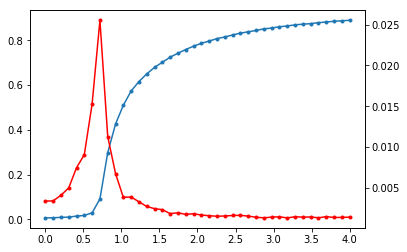

========
Examples
========

Dynamics
========

Kuramoto
--------

stDoG provides two implementations of Heun’s method. The 
first uses the tensorflow. Therefore, it can be used with both 
CPU’s or GPU’s. The second implementation is a python wrapper to a 
CUDA code. The second (CUDA) is  faster than tensorflow implementation. 
However, a CUDA-compatible GPU is required

Creating the data and setting the variables

.. code-block:: python

    import numpy as np
    import igraph as ig
    from stdog.utils.misc import ig2sparse 
    num_couplings = 40
    N = 20480

    G = ig.Graph.Erdos_Renyi(N, 3/N)
    adj = ig2sparse(G)

    omegas = np.random.normal(size= N).astype("float32")
    couplings = np.linspace(0.0,4.,num_couplings)
    phases =  np.array([
        np.random.uniform(-np.pi,np.pi,N)
        for i_l in range(num_couplings)

    ],dtype=np.float32)

    precision =32

    dt = 0.01
    num_temps = 50000
    total_time = dt*num_temps
    total_time_transient = total_time
    transient = False

Solving the diferential equation in tensorflow
^^^^^^^^^^^^^^^^^^^^^^^^^^^^^^^^^^^^^^^^^^^^^^

.. code-block:: python

    from stdog.dynamics.kuramoto import Heuns

    heuns_0 = Heuns(adj, phases, omegas, couplings, total_time, dt,         
        device="/gpu:0", # or /cpu:
        precision=precision, transient=transient)

    heuns_0.run()
    heuns_0.transient = True
    heuns_0.total_time = total_time_transient
    heuns_0.run()
    order_parameter_list = heuns_0.order_parameter_list

Plotting the result 

.. code-block:: python

    import matplotlib.pyplot as plt

    r = np.mean(order_parameter_list, axis=1)
    stdr = np.std(order_parameter_list, axis=1)

    plt.ion()
    fig, ax1 = plt.subplots()
    ax1.plot(couplings,r,'.-')
    ax2 = ax1.twinx()
    ax2.plot(couplings,stdr,'r.-')
    plt.show()

Solving the diferential equation in CUDA 
^^^^^^^^^^^^^^^^^^^^^^^^^^^^^^^^^^^^^^^^^^^^^^

For that, you need install our another package, 
`cukuramoto <http://github.com/stdogpkg/cukuramoto>`_

.. code-block:: bash

    $ pip install cukuramoto

.. code-block:: python

    from stdog.dynamics.kuramoto.cuheuns import CUHeuns as cuHeuns

    heuns_0 = cuHeuns(adj, phases, omegas,  couplings,
        total_time, dt, block_size = 1024, transient = False)

    heuns_0.run()

    heuns_0.transient = True
    heuns_0.total_time = total_time_transient
    heuns_0.run()
    order_parameter_list = heuns_0.order_parameter_list
 
Spectra
=======

Spectral Density
----------------

The Kernel Polynomial Method can estimate the spectral density of large
sparse Hermitan matrices with a computational cost almost linear. This method
combines three key ingredients: the Chebyshev expansion + the stochastic
trace estimator + kernel smoothing.

.. code-block:: python

    import igraph as ig
    import numpy as np

    N = 3000
    G = ig.Graph.Erdos_Renyi(N, 3/N)

    W = np.array(G.get_adjacency().data, dtype=np.float64)
    vals = np.linalg.eigvalsh(W).real

.. code-block:: python

    import stdog.spectra as spectra
    from stdog.utils.misc import ig2sparse 

    W = ig2sparse(G)
    num_moments = 300
    num_vecs = 200
    extra_points = 10
    ek, rho = spectra.dos.kpm(W, num_moments, num_vecs, extra_points, device="/gpu:0")

.. code-block:: python

    import matplotlib.pyplot as plt
    plt.hist(vals, density=True, bins=100, alpha=.9, color="steelblue")
    plt.scatter(ek, rho, c="tomato", zorder=999, alpha=0.9, marker="d")
    plt.ylim(0, 1)
    plt.show()

.. image:: imgs/kpm_dos.png

Trace Functions
---------------